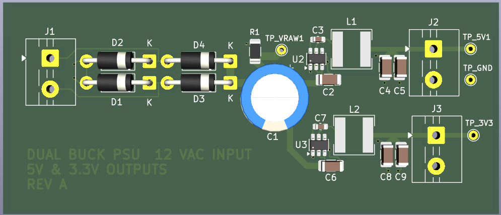
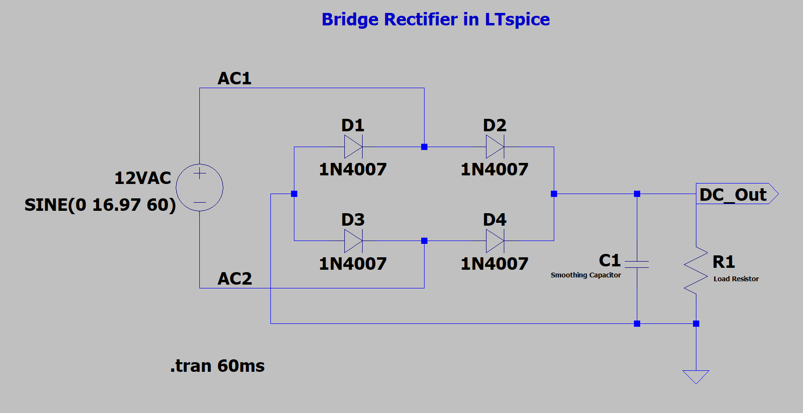
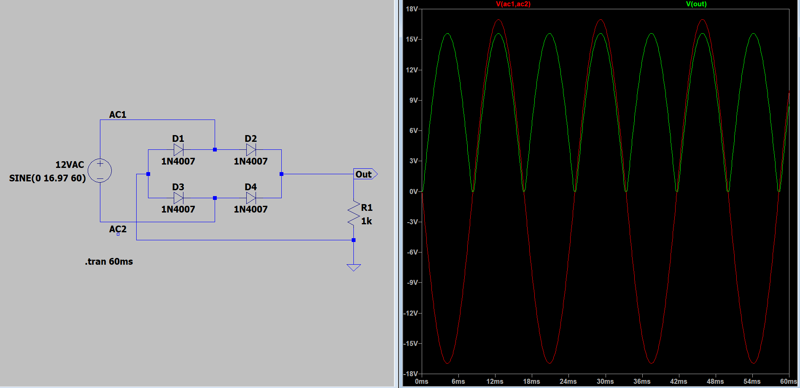
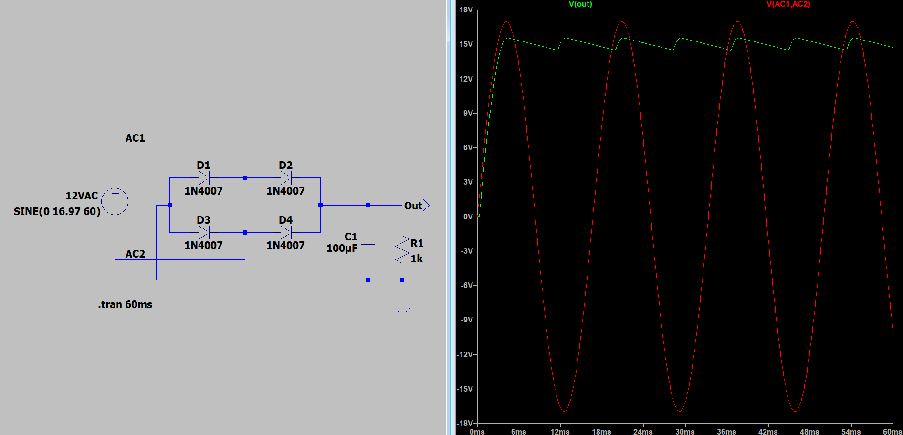
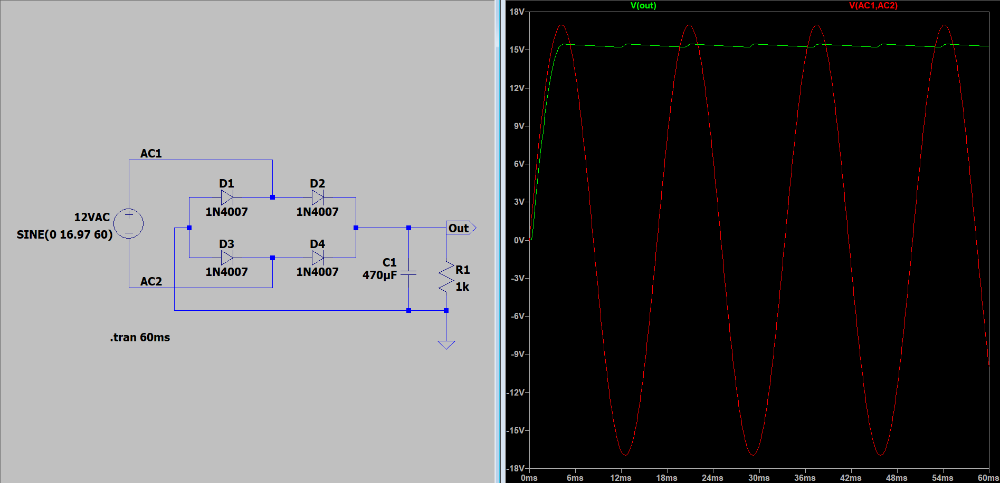
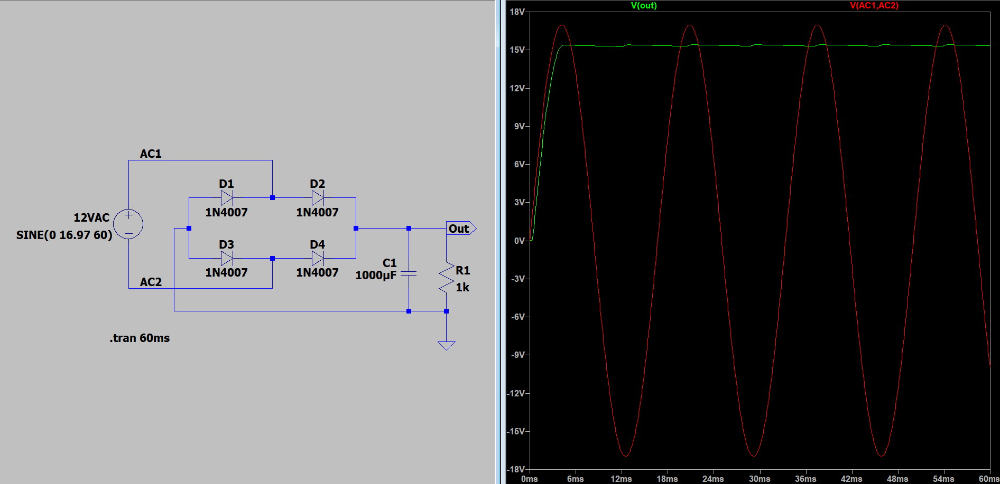
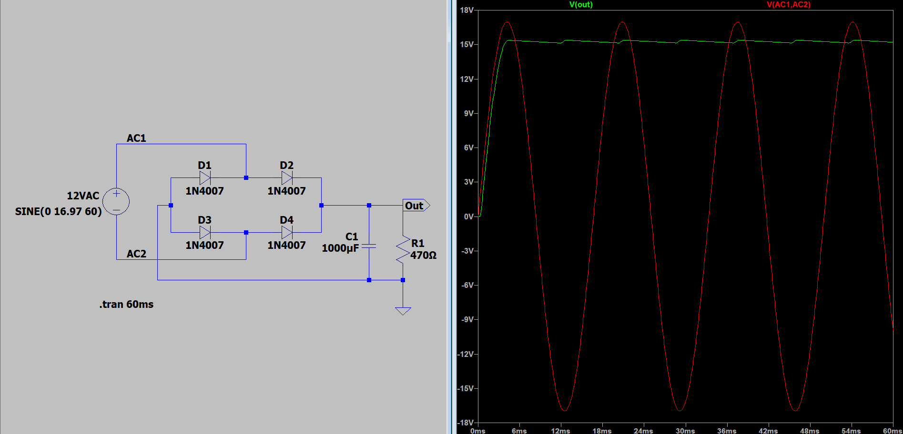
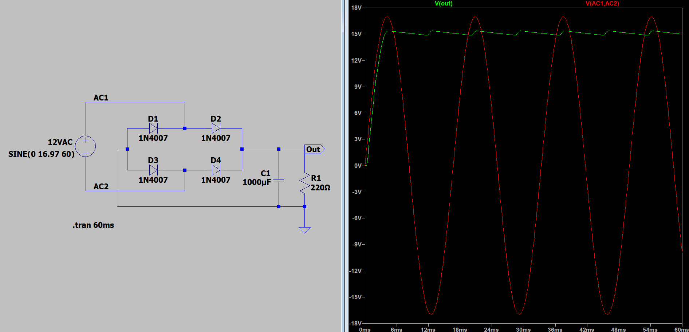

# 12VAC Dual-Output Buck Power Supply PCB

**Status:** Design Complete / Fabrication Pending  
**Input:** 12 VAC RMS, 60 Hz  
**Outputs:** Fixed 5 V and 3.3 V rails  
**PCB:** 2-layer, 80.15 mm × 34.20 mm, 1.6 mm FR-4 *Subject to Design Changes due to part availability
**Design tools:** KiCad 9 and LTspice



## Design Decision

The original architecture used an LM7805 for the 5 V rail and a second linear regulator for 3.3 V. LTspice rectifier work placed the filtered DC bus near 15.6 V. At a 5 V, 1 A operating point, the LM7805 would dissipate:

```text
PLOSS = (VIN - VOUT) × IOUT
PLOSS = (15.6 V - 5 V) × 1 A
PLOSS = 10.6 W
```

That loss would turn the regulator into the dominant thermal problem and require heatsinking that was not part of the original board concept. The design was therefore rebuilt around two fixed-output synchronous buck converters connected in parallel to the rectified DC bus:

- **AP63205WU** for the 5 V rail
- **AP63203WU** for the 3.3 V rail

The redesign removed the dependency between the two outputs and reduced the expected conversion loss relative to the original linear architecture. The PCB design, routing, footprint verification, and fabrication review are complete. The board has not yet been fabricated, assembled, or bench-tested.

## Final Architecture

```text
12 VAC input
      ↓
1N4004 full-wave bridge rectifier
      ↓
1000 µF bulk capacitor + 10 kΩ bleeder
      ↓
VRAW rectified DC bus
      ├───────────────────────────────┐
      ↓                               ↓
AP63205WU fixed 5 V buck              AP63203WU fixed 3.3 V buck
10 µF input capacitor                 10 µF input capacitor
100 nF bootstrap capacitor            100 nF bootstrap capacitor
4.7 µH inductor                       3.9 µH inductor
2 × 22 µF output capacitors           2 × 22 µF output capacitors
      ↓                               ↓
5 V connector + test point            3.3 V connector + test point
```

Both buck stages draw from `VRAW`. Each regulator therefore starts from the same rectified bus rather than cascading the 3.3 V rail from the 5 V output.

## Circuit Implementation

### AC-to-DC Front End

The input stage uses four **1N4004** diodes in a full-wave bridge. A **35PK1000MEFC10X20 1000 µF electrolytic capacitor** provides bulk energy storage after rectification. A **CRCW120610K0FKEA 10 kΩ resistor** is connected across the raw DC bus.

The bridge output is exposed at `TP_VRAW1` for bring-up and ripple measurement.

### 5 V Rail

The 5 V output uses an **AP63205WU** fixed-output synchronous buck converter with:

- **GMK316BJ106KL-T**, 10 µF input capacitor
- **C0603C104K5RACTU**, 100 nF bootstrap capacitor
- **TYS60284R7N-10**, 4.7 µH power inductor
- Two **TMK316BBJ226ML-T**, 22 µF output capacitors in parallel

The output is available through connector `J2` and test point `TP_5V1`.

### 3.3 V Rail

The 3.3 V output uses an **AP63203WU** fixed-output synchronous buck converter with:

- **GMK316BJ106KL-T**, 10 µF input capacitor
- **C0603C104K5RACTU**, 100 nF bootstrap capacitor
- **SWPA6028S3R9NT**, 3.9 µH power inductor ** Subject to change due to product availability
- Two **TMK316BBJ226ML-T**, 22 µF output capacitors in parallel

The output is available through connector `J3` and test point `TP_3V3`.

### Connectors and Test Access

The three board connectors are **MAX MX126-5.0-02P-GN01-Cu-S-A** terminal blocks:

- `J1`: 12 VAC input
- `J2`: 5 V output
- `J3`: 3.3 V output

Dedicated test points provide access to:

- `VRAW`
- 5 V output
- 3.3 V output
- Ground

## Component Selection

| Reference / Function | Selected part | Value / role |
|---|---|---|
| D1-D4 | 1N4004 | Full-wave bridge rectifier |
| C1 | 35PK1000MEFC10X20 | 1000 µF bulk capacitor |
| U2 | AP63205WU | Fixed 5 V synchronous buck converter |
| U3 | AP63203WU | Fixed 3.3 V synchronous buck converter |
| C2, C6 | GMK316BJ106KL-T | 10 µF buck input capacitors |
| C3, C7 | C0603C104K5RACTU | 100 nF bootstrap capacitors |
| C4, C5, C8, C9 | TMK316BBJ226ML-T | 22 µF output capacitors |
| L1 | TYS60284R7N-10 | 4.7 µH power inductor |
| L2 | SWPA6028S3R9NT | 3.9 µH power inductor |
| R1 | CRCW120610K0FKEA | 10 kΩ VRAW bleeder resistor |
| J1-J3 | MAX MX126-5.0-02P-GN01-Cu-S-A | 5.0 mm terminal blocks |

## LTspice Rectifier Study

The rectifier stage was simulated before the final PCB architecture was selected. The 12 VAC RMS source was modeled as:

```text
SINE(0 16.97 60)
```

The simulation sweep compared:

- No smoothing capacitor
- 100 µF, 470 µF, and 1000 µF smoothing capacitors
- 1 kΩ, 470 Ω, and 220 Ω loads

The existing LTspice model used 1N4007 diode models for the rectifier study; the final PCB BOM uses 1N4004 diodes.

### Simulation Results

The simulated waveforms showed:

- A full-wave rectified waveform with no smoothing capacitor
- Lower ripple as capacitance increased from 100 µF to 470 µF and 1000 µF
- Faster capacitor discharge and greater ripple as the load resistance decreased
- Approximately 15.6 V on the filtered DC bus in the 1000 µF, 1 kΩ simulation case

These are simulation results only. No physical-board measurements have been collected.

### Bridge Rectifier Schematic



### No Smoothing Capacitor, 1 kΩ Load



### 100 µF, 1 kΩ Load



### 470 µF, 1 kΩ Load



### 1000 µF, 1 kΩ Load



### 1000 µF, 470 Ω Load



### 1000 µF, 220 Ω Load



## PCB Layout

The final board is a two-layer KiCad design with a 1.6 mm FR-4 stackup. The layout uses the top copper layer for component placement and most routing, with a ground zone across the bottom copper layer.

Layout decisions included:

- Keeping each buck converter's input capacitor close to its `IN` and `GND` pins
- Keeping the `SW` copper area limited
- Placing each bootstrap capacitor between `BST` and `SW`
- Routing the feedback connection from the regulated output side of the inductor
- Placing the paired 22 µF capacitors close to each output stage
- Using wider traces for the rectified bus and output-current paths
- Connecting local ground returns to the bottom ground plane with vias
- Providing direct test access to the raw bus, both regulated rails, and ground

A custom inductor footprint was created for the selected 6 mm-class inductors. It uses **1.7 mm × 5.7 mm pads** with a **2.8 mm gap** between pad edges.

## Design Status

**Design Complete / Fabrication Pending**

Completed:

- Rectifier simulation sweep
- Linear-regulator thermal analysis
- Dual-buck architecture selection
- Exact component selection
- KiCad schematic capture
- Footprint assignment and verification
- Custom inductor footprint creation
- Two-layer PCB placement and routing
- Bottom-layer ground plane and ground-via implementation
- Test-point placement
- Gerber and drill-file review

Pending:

- PCB fabrication
- Assembly
- Continuity and short-circuit inspection
- First power-on
- Output-voltage verification
- Ripple and load-regulation measurements
- Efficiency calculation
- Thermal characterization

## Planned Bring-Up

The physical board will be evaluated in stages after fabrication.

1. **Unpowered inspection**
   - Verify diode and electrolytic-capacitor polarity
   - Inspect solder joints and component orientation
   - Check resistance from `VRAW`, 5 V, and 3.3 V to ground
   - Confirm connector pin assignments

2. **Rectifier-stage verification**
   - Apply the isolated 12 VAC input
   - Measure `VRAW` with a DMM
   - Observe the raw-bus ripple at `TP_VRAW1`
   - Compare the waveform with the LTspice rectifier study

3. **No-load regulator verification**
   - Confirm the 5 V and 3.3 V outputs
   - Check startup behavior and current draw
   - Monitor the bridge diodes, buck converters, and inductors for abnormal heating

4. **Loaded characterization**
   - Measure output accuracy and load regulation
   - Measure ripple on both regulated outputs
   - Calculate input power, output power, and conversion efficiency
   - Record component temperatures under sustained load

No measured values will be added to this README until the fabricated board has been assembled and tested.

## Project Files

The repository includes:

- Original system-level concept
- LTspice rectifier source and waveform captures
- KiCad schematic and final PCB layout
- Custom inductor footprint
- PCB screenshots and 3D render

Fabrication outputs and bench measurements will be added after those stages are completed.
