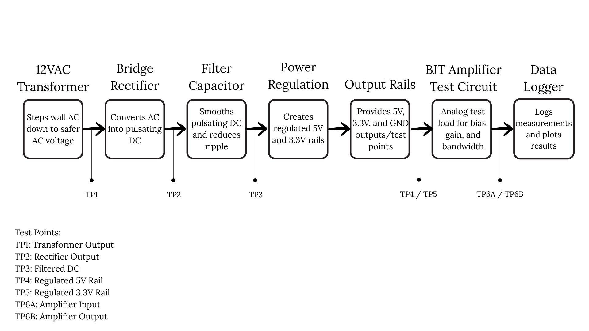

# Custom PSU PCB and Analog Characterization Platform

## Project Overview

This project is a self-directed hardware design and testing project focused on designing a custom regulated power supply PCB and using it as an analog characterization platform. The system is intended to generate regulated 5 V and 3.3 V rails, support circuit testing, and provide hands-on practice with simulation, PCB layout, measurement, and debugging.

The project is being developed through a full design-to-test workflow:

```text
Hand calculations → LTspice simulation → KiCad schematic/PCB layout → bench validation
```

Current work focuses on simulating the bridge rectifier stage in LTspice to understand AC-to-DC conversion, smoothing capacitor behavior, ripple voltage, and load effects before completing PCB layout and hardware testing.

## Project Goals

- Design a regulated 5 V / 3.3 V power supply PCB.
- Include bridge rectification, filtering capacitors, LM7805 regulation, protection circuitry, and test points.
- Simulate power supply behavior before PCB fabrication.
- Compare hand calculations, LTspice simulations, and oscilloscope/DMM measurements.
- Measure ripple voltage, load regulation, dropout behavior, and DC output stability.
- Use the supply as a future analog characterization platform for amplifier testing.
- Document the full design-to-test process with simulation screenshots, plots, measurement notes, and debugging results.

## System Architecture

```text
12 VAC Transformer
        ↓
Bridge Rectifier
        ↓
Smoothing Capacitor
        ↓
LM7805 5 V Regulator
        ↓
3.3 V Regulator
        ↓
Output Rails / Test Points
        ↓
Future Analog Test Circuit / Data Logging
```

### System-Level Layout



**Caption:** System-level layout for the PSU characterization platform, showing the signal flow from 12 VAC input through bridge rectification, filtering, regulation, output rails, analog test circuitry, and data logging.

## Current Status

- Created system-level layout and test point plan.
- Simulated the bridge rectifier stage in LTspice.
- Compared rectifier output with no capacitor, 100µF, 470µF, and 1000µF smoothing capacitors.
- Tested the effect of different load resistances using 1kΩ, 470Ω, and 220Ω loads.
- KiCad schematic and 2-layer PCB layout are in progress.
- Bench validation is planned using an oscilloscope and DMM measurements.

## LTspice Bridge Rectifier Simulation

The bridge rectifier simulation uses a 12 VAC RMS input modeled as a sine source with a 16.97 V peak amplitude at 60 Hz:

```text
SINE(0 16.97 60)
```

The rectifier uses four 1N4007 diodes and a resistive load. A smoothing capacitor is added across the output to reduce ripple and create a more stable DC voltage before regulation.

The LTspice source file is included here:

```text
ltspice/bridge_rectifier_schematic.asc
```

### Bridge Rectifier Schematic


**Caption:** LTspice bridge rectifier schematic used to simulate AC-to-DC conversion before PCB layout and hardware testing.

### Full-Wave Rectifier Without Smoothing Capacitor


**Caption:** Full-wave rectifier output without a smoothing capacitor, showing the unfiltered rectified waveform across a 1kΩ load.

### 100µF Smoothing Capacitor, 1kΩ Load


**Caption:** Bridge rectifier output with a 100µF smoothing capacitor across a 1kΩ load, showing reduced ripple compared with the unfiltered output.

### 470µF Smoothing Capacitor, 1kΩ Load


**Caption:** Bridge rectifier output with a 470µF smoothing capacitor across a 1kΩ load, showing stronger DC smoothing and lower ripple than the 100µF case.

### 1000µF Smoothing Capacitor, 1kΩ Load


**Caption:** Bridge rectifier output with a 1000µF smoothing capacitor across a 1kΩ load, showing stronger DC smoothing and lower ripple.

### 1000µF Smoothing Capacitor, 470Ω Load


**Caption:** Load resistance comparison using a 470Ω load with a 1000µF smoothing capacitor, showing how increased loading affects capacitor discharge and output ripple.

### 1000µF Smoothing Capacitor, 220Ω Load


**Caption:** Load resistance comparison using a 220Ω load with a 1000µF smoothing capacitor, showing how heavier loading increases capacitor discharge and affects output ripple.

## Simulation Summary

The LTspice simulations show the expected behavior of a bridge rectifier and smoothing capacitor:

- Without a capacitor, the output follows a full-wave rectified waveform.
- Adding a smoothing capacitor charges the output near the rectified peak voltage and reduces ripple.
- Larger capacitor values reduce ripple by discharging more slowly between peaks.
- Lower load resistance increases current demand, causing the capacitor to discharge faster and increasing ripple.
- These simulations help define expected DC behavior before moving into regulator testing and PCB layout.

## Planned Bench Validation

After the KiCad schematic and PCB layout are complete, the circuit will be tested using lab equipment.

Planned measurements include:

- Transformer output voltage at TP1
- Rectifier output at TP2
- Filtered DC voltage at TP3
- Regulated 5 V output at TP4
- Regulated 3.3 V output at TP5
- Ripple voltage under different capacitor and load conditions
- Load regulation
- Dropout behavior
- Comparison between hand calculations, LTspice simulations, and oscilloscope/DMM results

## Planned PCB Features

- 2-layer PCB layout in KiCad
- Bridge rectifier input stage
- LM7805 5 V regulation
- 3.3 V regulation
- Filtering capacitors
- Test points for each major stage
- Protection circuitry
- Output rails for analog testing and future expansion

## Repository Structure

```text
custom-psu-analog-test-platform/
├── README.md
├── 01_docs/
│   └── original_layout_design.jpg
├── 02_ltspice/
│   ├── bridge_rectifier_schematic.asc
│   └── screenshots/
│       ├── schematic.png
│       ├── t1_fwr_no_cap_1k_res.png
│       ├── t2_fwr_100uf_cap_1k_res.png
│       ├── t3_fwr_470uf_cap_1k_res.png
│       ├── t4_fwr_1000uf_cap_1k_res.png
│       ├── t5_fwr_1000uf_cap_470_res.png
│       └── t6_fwr_1000uf_cap_220_res.png
└── 03_kicad/
```

## Future Improvements

Future project additions may include:

- BJT amplifier test circuit powered from the regulated rails
- Gain, bias point, and bandwidth characterization
- Python-based measurement logging and plotting
- Buck converter comparison for linear vs. switching regulation
- Thermal and efficiency comparison between regulator approaches

## Tools Used

- LTspice
- KiCad
- Oscilloscope
- Digital multimeter
- DC power supply
- Function generator
- Python
